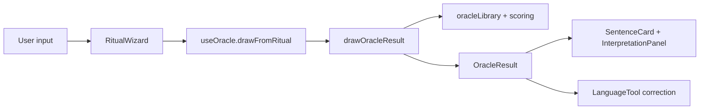
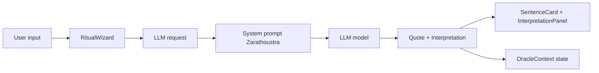

# AUDIT_MIGRATION_ZARATHUSTRA

## 1) AUDIT DU CODE ACTUEL (oracle_html_3)

Fichiers critiques (moteur + UI):
- Moteur logique: `C:\ATLAS\INBOX\dev\R_D\carte_de_visite\test_unitaire\oracle_html_3\src\domain\oracleEngine.ts`
- Corpus local: `C:\ATLAS\INBOX\dev\R_D\carte_de_visite\test_unitaire\oracle_html_3\src\domain\oracleLibrary.ts`
- Types metier: `C:\ATLAS\INBOX\dev\R_D\carte_de_visite\test_unitaire\oracle_html_3\src\domain\types.ts`
- Hook central: `C:\ATLAS\INBOX\dev\R_D\carte_de_visite\test_unitaire\oracle_html_3\src\hooks\useOracle.ts`
- Contexte app: `C:\ATLAS\INBOX\dev\R_D\carte_de_visite\test_unitaire\oracle_html_3\src\context\OracleContext.tsx`
- Chargement du corpus: `C:\ATLAS\INBOX\dev\R_D\carte_de_visite\test_unitaire\oracle_html_3\src\services\dataLoader.ts`
- Post-traitement: `C:\ATLAS\INBOX\dev\R_D\carte_de_visite\test_unitaire\oracle_html_3\src\services\orthography.ts`
- UI principale: `C:\ATLAS\INBOX\dev\R_D\carte_de_visite\test_unitaire\oracle_html_3\src\components\layout\OracleLayout.tsx`
- UI rituel: `C:\ATLAS\INBOX\dev\R_D\carte_de_visite\test_unitaire\oracle_html_3\src\components\oracle\RitualWizard.tsx`
- UI resultat: `C:\ATLAS\INBOX\dev\R_D\carte_de_visite\test_unitaire\oracle_html_3\src\components\oracle\SentenceCard.tsx`
- UI interpretation: `C:\ATLAS\INBOX\dev\R_D\carte_de_visite\test_unitaire\oracle_html_3\src\components\oracle\InterpretationPanel.tsx`
- Style global: `C:\ATLAS\INBOX\dev\R_D\carte_de_visite\test_unitaire\oracle_html_3\src\index.css`

Fonctions moteur a supprimer/remplacer (legacy):
- `drawOracleResult(...)` (selection de citation + interpretation deterministe)
- `buildInterpretation(...)` (construction regles/paragraphes)
- `scoreThemesForText(...)`, `analyzeTone(...)`, `classifyQuestion(...)`, `pickLibraryPieces(...)`
- `ORACLE_LIBRARY` (bibliotheque de paragraphes pre-ecrits)
- `utils/rng.ts` et dependances de seed si plus utiles

Structure UI a conserver:
- Wizard multi-etapes (nom, humeur, format, question) dans `RitualWizard.tsx`
- Carte de citation (`SentenceCard.tsx`)
- Panneau d interpretation (`InterpretationPanel.tsx`)
- Layout general (`OracleLayout.tsx`)

Logique actuelle (simplifiee):
- `useOracle` charge le corpus local via `dataLoader.ts`
- Tirage deterministe par seed + classification + bibliotheque
- Post-correction orthographique via LanguageTool

## 2) CARTOGRAPHIE DES FLUX

Flux actuel (legacy):


Flux cible (LLM Zarathoustra):


## 3) FEUILLE DE ROUTE (STEP-BY-STEP)

Etape 1 - Nettoyage (legacy)
- Remplacer l usage de `drawOracleResult` dans `useOracle.ts` par un appel LLM.
- Garder `dataLoader.ts` si vous souhaitez alimenter le LLM avec un corpus local de citations.
- Supprimer ou isoler `oracleLibrary.ts`, `scoreThemesForText`, `analyzeTone`, `classifyQuestion`, `pickLibraryPieces` si non utilises.

Etape 2 - Injection du client LLM (pattern financial_dashboard)
- Reutiliser la stack LLM observee:
  - `server/chat/chat-processor.ts` (pattern `createAIRunner` + `ChatModel`)
  - `server/chat/LlamaChatModel.ts` (fallback Ollama)
  - `server/chat/chat-constants.ts` (system prompt)
  - `server/chat/chat.ts` (transport socket)
- Modele par defaut dans le pattern: `openai:gpt-4o-mini` via `@dexaai/dexter`.
- Cle API: geree par l SDK OpenAI (attendu via variable d environnement type `OPENAI_API_KEY`).
- Streaming: non implemente (pas de stream token par token).

Integration recommandee (nouvelle app):
- Creer un service LLM cote serveur (ou edge) qui expose un endpoint simple:
  - POST `/api/oracle` avec `{ ritual, context }`
  - Retour `{ quote, interpretation, meta }`
- Cote client, remplacer `drawOracleResult` par un call async.

Etape 3 - Prompt System "Zarathoustra" (proposition)
```text
You are Zarathoustra, voice of "Thus Spoke Zarathustra".
Write in French, poetic but clear, no modern slang.
Goal: select one exact quote from the provided corpus that best matches the user context,
then deliver a short mystical exegesis tailored to the user.

Rules:
- Quote must be an exact sentence from the corpus. Do not invent or paraphrase the quote.
- Output format:
  QUOTE: "<exact quote>"
  INTERPRETATION: "<2-4 short paragraphs, personal and concrete>"
- Do not mention you are an AI.
```

Etape 4 - Cabalge UI
- Conserver `RitualWizard` pour collecter `RitualInput`.
- Adapter `OracleContext` + `useOracle` pour stocker:
  - `quote` (texte exact + metadata si dispo)
  - `interpretation` (texte LLM)
- `SentenceCard` affiche la citation exacte.
- `InterpretationPanel` affiche l exegese et le recap du rituel.

Notes de migration:
- Si vous gardez le corpus local, envoyez au LLM un petit set (top-N) pour limiter le prompt.
- Conservez `dataLoader.ts` pour charger les citations et selectionner N candidates.
- Le LLM ne remplace pas l UI: il remplace uniquement `oracleEngine.ts`.
