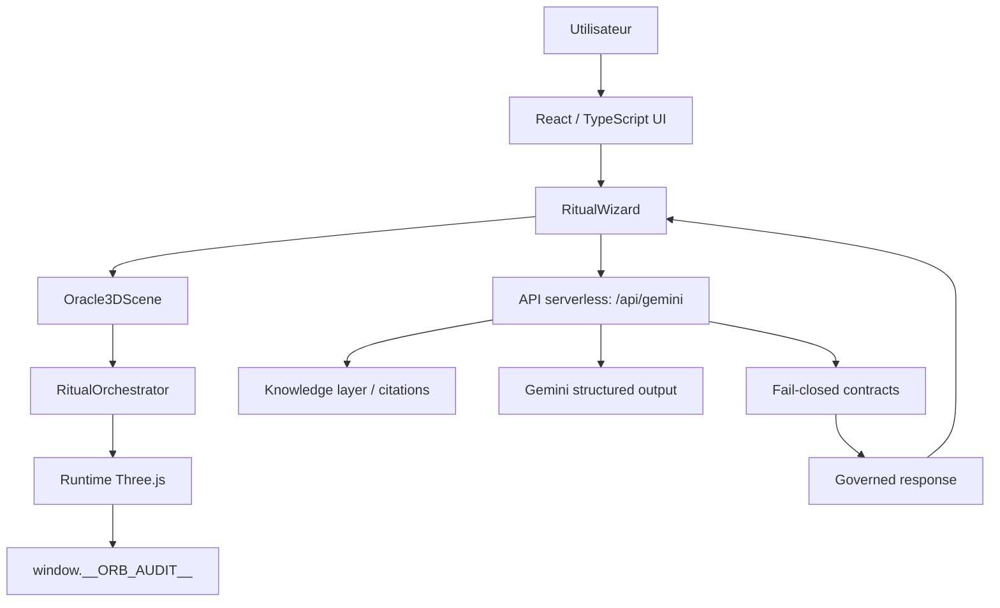
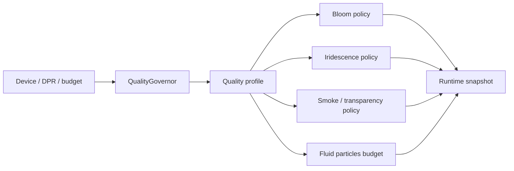
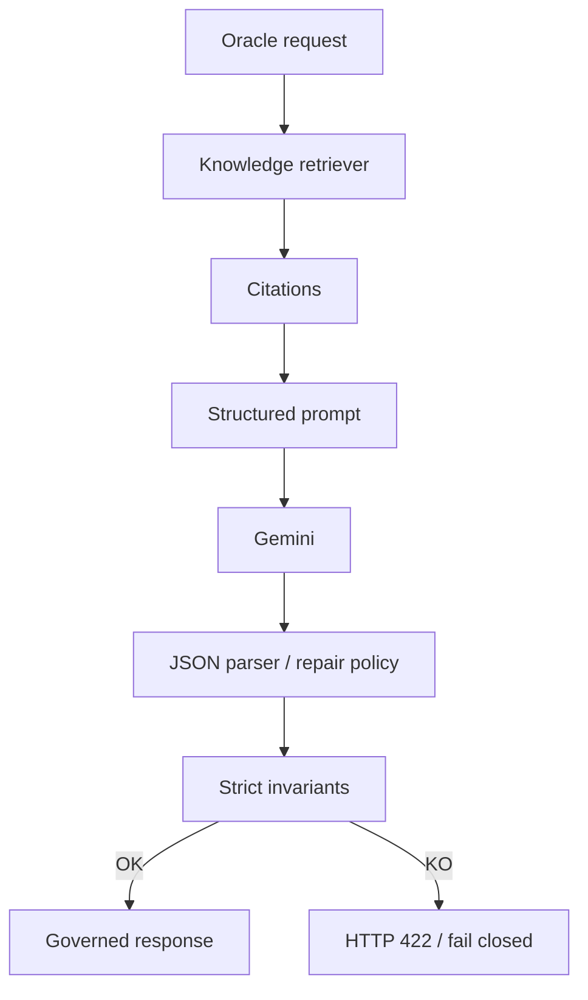
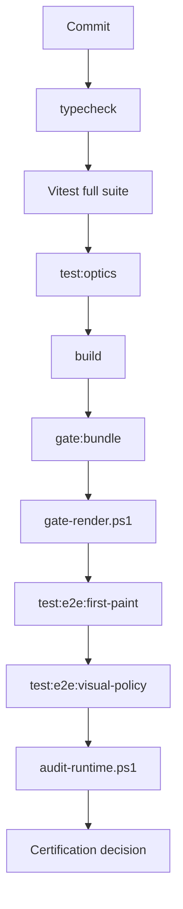

# Oracle Zarathustra LLMed

[](https://appllmedwtfix.vercel.app)

Oracle Zarathustra LLMed est une démonstration d'ingénierie autour d'un moteur rituel 3D gouverné et d'une couche LLM contractualisée.

Le projet ne se limite pas à une expérience visuelle. Il montre comment transformer un prototype créatif 3D/LLM en système testable, observable, auditable et certifiable.

## Démo officielle

URL publique de démonstration : [`https://appllmedwtfix.vercel.app`](https://appllmedwtfix.vercel.app)

Cette URL est la cible Vercel de référence pour la branche vitrine.

## Résumé exécutif

Le repo démontre trois capacités complémentaires :

1. une interface produit immersive ;
2. un runtime 3D gouverné par profils qualité, politiques optiques et audit navigateur ;
3. une couche LLM fail-closed, structurée par contrats, citations et invariants herméneutiques.

Branche runtime certifiée :

```text
oracle.z.demo
```

SHA certifié :

```text
f5a0555a495e7b30037382bf510f750d614fc597
```

Branche documentaire stricte :

```text
docs/oracle-z-demo-presentation-20260430
```

## Problème traité

Les prototypes mêlant WebGL, effets optiques, LLM et narration interactive échouent souvent sur les mêmes points :

- rendu spectaculaire mais fragile ;
- comportement adaptatif non piloté ;
- absence de preuves sur les régressions visuelles ;
- réponses LLM plausibles mais non contractualisées ;
- CI réduite au build ;
- difficulté à expliquer l'architecture à un lecteur externe.

Ce repo répond à ce problème par une logique de gouvernance : chaque partie critique du système est rendue observable, testable et vérifiable.

## Démo produit

L'application propose une expérience d'oracle interactif :

- interface React ;
- scène 3D Three.js lazy-loadée ;
- rituel progressif ;
- rendu atmosphérique ;
- politiques bloom, iridescence, transparence et smoke ;
- réponse LLM structurée côté serveur ;
- audit runtime exposé dans le navigateur.

## Architecture macro



## Gouvernance runtime 3D

Le runtime 3D est gouverné par :

- un `QualityGovernor` ;
- des profils `ultra`, `high`, `medium`, `low`, `safe` ;
- des politiques optiques centralisées ;
- des budgets bundle ;
- des tests unitaires et AST ;
- des E2E Playwright ciblés ;
- un bridge d'audit navigateur.



## Gouvernance LLM

La couche LLM est fail-closed. Une réponse ne devient acceptable que si elle satisfait des invariants explicites :

- JSON structuré ;
- citations suffisantes ;
- citations résolues ;
- rôles herméneutiques couverts ;
- absence d'erreur finale ;
- audit exploitable.



## CI/CD comme système de certification

La CI ne vérifie pas seulement que le projet compile. Elle vérifie que les contrats essentiels tiennent.



## Lecture documentaire recommandée

| Besoin | Document |
|---|---|
| Comprendre la documentation | [`docs/README.md`](docs/README.md) |
| Comprendre le contrat système | [`docs/SYSTEM_CONTRACT.md`](docs/SYSTEM_CONTRACT.md) |
| Comprendre l'architecture complète | [`docs/ARCHITECTURE_MASTER.md`](docs/ARCHITECTURE_MASTER.md) |
| Lancer, auditer, diagnostiquer | [`docs/RUNBOOK.md`](docs/RUNBOOK.md) |
| Voir les preuves certifiées | [`docs/certification/oracle-z-demo-certification.md`](docs/certification/oracle-z-demo-certification.md) |
| Parcourir les preuves disponibles | [`docs/certification/evidence-index.md`](docs/certification/evidence-index.md) |
| Préparer une page portfolio | [`artifacts/portfolio/README.md`](artifacts/portfolio/README.md) |

## Certification locale

Commandes critiques :

```powershell
git diff --check
npm.cmd run typecheck
npm.cmd run test:optics
npm.cmd run test
npm.cmd run build
npm.cmd run gate:bundle
pwsh -NoProfile -ExecutionPolicy Bypass -File .\scripts\gate-render.ps1
npm.cmd run test:e2e:first-paint
npm.cmd run test:e2e:visual-policy
pwsh -NoProfile -ExecutionPolicy Bypass -File .\scripts\audit-runtime.ps1
```

## Structure documentaire stricte

```text
docs/
  README.md
  SYSTEM_CONTRACT.md
  ARCHITECTURE_MASTER.md
  RUNBOOK.md
  certification/

artifacts/
  portfolio/
    README.md
```

Cette branche de présentation ne modifie pas `src/**`, `scripts/**` ni `.github/**` par rapport à `oracle.z.demo`.

## Valeur engineering

Ce repo démontre :

- capacité à industrialiser une expérience créative complexe ;
- maîtrise TypeScript, React et Three.js ;
- discipline CI/CD ;
- logique d'audit ;
- pensée système ;
- séparation entre preuve locale, preuve distante et documentation ;
- capacité à transformer un prototype en actif présentable.

## Limitations connues

- Les logs `.audit/` sont locaux et non versionnés.
- Le chunk Three.js dépasse le warning Vite standard, mais reste sous budget du `gate:bundle`.
- Les E2E larges de rituel complet peuvent être traités comme passe complémentaire.

## Roadmap courte

1. Vérifier le rendu Mermaid du README sur GitHub.
2. Relancer la validation locale après cette passe documentaire.
3. Relire la PR avant merge vers `oracle.z.demo`.
4. N'intégrer que si les checks distants restent verts.
