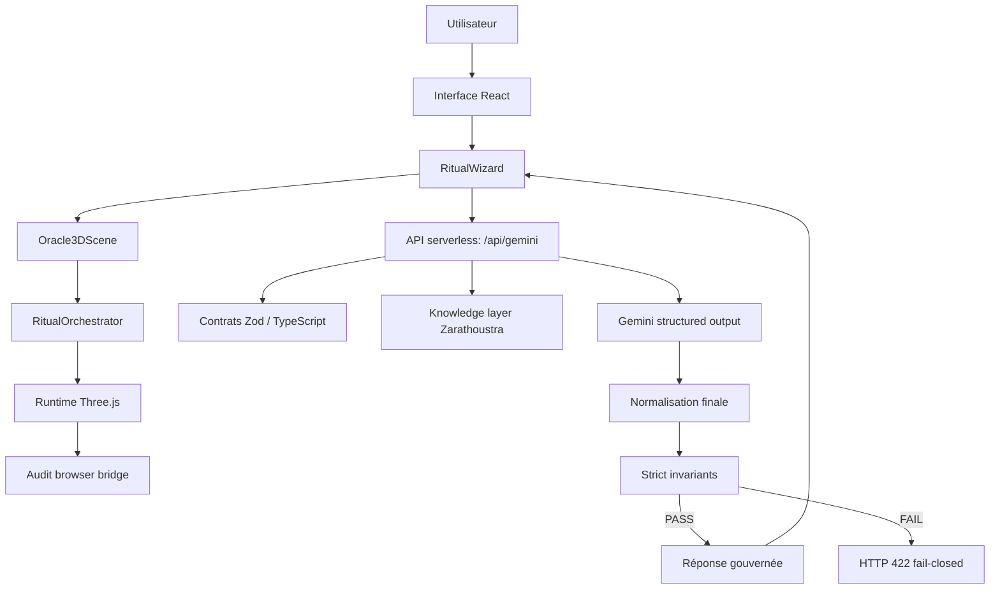
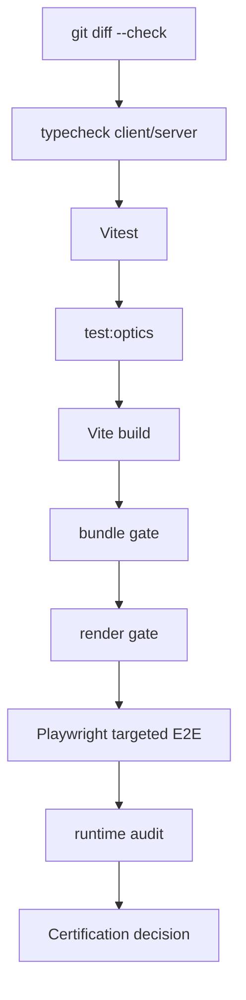

# Architecture Master — Oracle Zarathustra LLMed

## Rôle du document

Ce document donne une vue d’ensemble lisible du système. Il ne remplace pas `SYSTEM_CONTRACT.md` ; il explique comment les couches produit, runtime 3D, backend LLM, knowledge et certification s’articulent.

## Intention produit

Oracle Zarathustra LLMed est un moteur rituel interactif : une interface React orchestre un parcours utilisateur, une scène Three.js traduit ce parcours en états visuels, et une route serveur `/api/gemini` produit une réponse LLM gouvernée par contrats, citations et invariants stricts.

La valeur du projet n’est pas seulement esthétique. Le projet démontre qu’une expérience 3D/LLM peut être structurée comme un système vérifiable : rendu gouverné, sortie LLM contractualisée, audit runtime, gates locaux, preuves versionnées.

## Vue macro

## Couches principales

| Couche | Responsabilité | Exemples |
|---|---|---|
| UI produit | Parcours, saisies, révélation, rendu de réponse | `RitualWizard`, composants Oracle |
| Scène 3D | Initialisation Three.js, pont React/runtime, audit navigateur | `Oracle3DScene` |
| Orchestration 3D | Traduction état rituel -> climat, lumière, matériaux, particules | `RitualOrchestrator` |
| Gouvernance qualité | Profils performance et budgets visuels | `QualityGovernor` |
| Politiques optiques | Bloom, iridescence, transparence, smoke | `runtimeOpticsPolicy`, `bloomPolicy`, `transparency` |
| Matériaux | Application centralisée des flags sensibles | `applyMaterials` |
| API LLM | Point d’entrée serveur, enveloppe, erreurs, timings | `/api/gemini` |
| Knowledge | Corpus lock, citations, mapping | couche Zarathoustra |
| Contrats | Validation runtime, fail-closed, invariants | schémas et tests serveur |
| Certification | Typecheck, tests, build, gates, E2E, audit | scripts PowerShell + npm |

## Flux nominal

1. L’utilisateur progresse dans l’interface.
2. `RitualWizard` maintient l’état rituel et déclenche les transitions.
3. `Oracle3DScene` expose un pont vers le runtime Three.js.
4. `RitualOrchestrator` applique les variations de climat, forme, lumière et particules.
5. L’UI appelle `/api/gemini` pour produire une réponse gouvernée.
6. Le serveur récupère des citations Zarathoustra si le mode l’exige.
7. Gemini produit une sortie structurée ou une sortie normalisée.
8. Les invariants stricts évaluent l’état final accepté.
9. Le serveur retourne soit une réponse `ok=true`, soit une erreur fail-closed.
10. L’UI rend la réponse et peut articuler la scène autour du résultat.

## Gouvernance 3D

Le runtime 3D est traité comme une surface à risque : instable par nature, coûteuse en performance et sensible aux effets de bord optiques.

Garde-fous principaux :

- profil qualité central ;
- budgets visuels ;
- politiques optiques ;
- `applyMaterials` comme point d’application contrôlé ;
- audit runtime exposé au navigateur ;
- tests ciblés sur les politiques visuelles ;
- E2E first-paint et visual-policy.

## Gouvernance LLM

La couche LLM est fail-closed : une réponse plausible n’est pas automatiquement une réponse acceptable.

Invariants principaux :

- corpus chargé quand requis ;
- citations minimales ;
- sources verrouillées ;
- JSON final valide ;
- erreurs finales nulles en succès ;
- observabilité disponible ;
- violations explicites en cas d’échec.

La documentation normative est dans [`SYSTEM_CONTRACT.md`](SYSTEM_CONTRACT.md).

## CI/CD et certification

## Surfaces de risque

| Risque | Contrôle |
|---|---|
| Régression visuelle silencieuse | tests optiques, E2E visual-policy, audit runtime |
| Explosion bundle | `gate:bundle` |
| Sortie LLM non conforme | schémas, invariants stricts, fail-closed |
| Citation absente ou mauvaise source | corpus lock, citation mapping, tests serveur |
| Port local occupé | runbook port `5173` |
| Documentation dispersée | README + documents canoniques |

## Limites connues

- Les artefacts complets `.audit/` restent locaux et ne sont pas versionnés.
- Les preuves portfolio doivent rester curées, non exhaustives.
- Le chunk Three.js peut dépasser le warning Vite standard tout en restant sous budget projet.

## Lecture en une phrase

Oracle Zarathustra LLMed est une architecture hybride où une expérience WebGL/LLM créative est rendue présentable par contrats, invariants, politiques de rendu, audits et preuves de certification.
