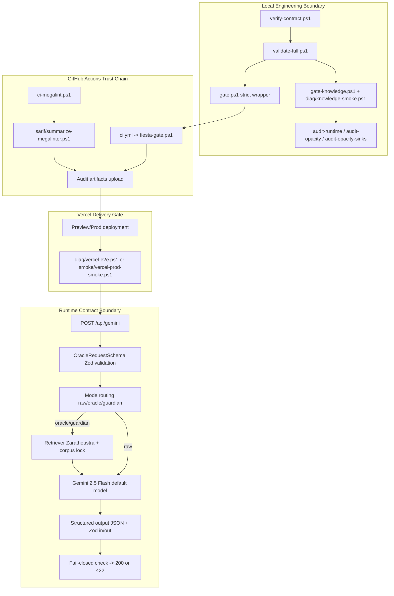

# SYSTEM CONTRACT - app_llmed_wt_fix

> Version: 2026-03-10
> Statut: Normatif (obligatoire)
> Objet: Garanties absolues, invariants runtime, et gouvernance de la chaine de livraison

## 1. Déclaration d'Invariants (Core Guarantees)

Le systeme applique un modele de **confiance minimale**: toute sortie non prouvable est rejetee ou degradee de facon explicite.

### 1.1 Fail-closed par defaut

Invariants non negociables sur `oracle` et `guardian`:

- `GEMINI_FAIL_CLOSED_STRICT` est **actif par defaut** pour `oracle`/`guardian` (`raw` exclu).
- Toute violation declenche `HTTP 422` avec `error.code = STRICT_INVARIANT_VIOLATION`.
- Les violations strictes sont explicites et codees:
  - `CITATIONS_TOO_LOW`
  - `SOURCE_LEAK`
  - `CITATION_ID_EMPTY`
  - `STRUCTURED_OUTPUTS_DISABLED`
  - `STRUCTURED_NOT_USED`
  - `JSON_ERROR`
  - `JSON_EMPTY`
  - `CORPUS_NOT_LOADED`

### 1.2 Corpus Lock (Zarathoustra)

Le systeme est verrouille sur le corpus local Zarathoustra:

- Les fichiers requis sont verifies au chargement (`zarathoustra.manifest.json` inclus).
- Le loader rejette tout corpus corrompu (`CRITICAL`) ou incomplet.
- Le retriever ne publie que des citations source `zarathoustra`.
- La sante connaissance expose `corpusLoaded`, `corpusSize`, `corpusHash`, `integrityMode`.

### 1.3 Exigence de citations

- `minCitations` est valide en entree par contrat (`0..12`, fail-fast en `400 INVALID_BODY` hors plage).
- Seuil effectif runtime en `oracle`/`guardian`: **minimum 2** (`Math.max(2, minCitations)` apres clamp).
- `citationsUsed` est verifie en strict sur la quantite, la source, et l'integrite des IDs.

## 2. Topologie CI/CD & Articulation du Système



**Point de controle TDM:** MegaLinter/SARIF est une capacite outillee (presets + scripts + resume KPI), mais sa criticite depend du preset/pipeline effectivement active.

## 3. Contrats d'API & Modes d'Exécution

### 3.1 Contrat de requete (extrait)

- Contrat d'entree: `OracleRequestSchema`
- Champs critiques: `prompt`, `mode`, `expectJson`, `wantCitations`, `minCitations`
- Borne contractuelle: `minCitations <= 12`

Exemple (oracle):

```json
{
  "mode": "oracle",
  "prompt": "Rituel: je franchis le seuil.",
  "expectJson": true,
  "wantCitations": true,
  "minCitations": 2,
  "ritual": {
    "step": "seuil",
    "intent": "clarifier"
  }
}
```

### 3.2 Modes d'execution

| Mode | Comportement | Garantie centrale |
| --- | --- | --- |
| `raw` | Prompt libre, citations facultatives, strict fail-closed desactive | Reponse enveloppee contractuelle (`ok`, `traceId`, `timings`) |
| `oracle` | Retriever Zarathoustra + prompt contraint + JSON structure | Cites min. enforcees, corpus lock, fail-closed 422 si invariant casse |
| `guardian` | Garde-fou de surete avec sortie JSON controlee | Meme discipline fail-closed que `oracle` |

### 3.3 Contrat de reponse (succes)

- Contrat de sortie: `ApiSuccessEnvelopeSchema` (`OracleResponseSchema` + `ok: true` + `timings`)
- `mode` est strictement enumere: `raw | oracle | guardian`
- `jsonError` est explicite (`null` ou code enumere)

Exemple (oracle, succes):

```json
{
  "ok": true,
  "traceId": "srv_20260310_abcd1234",
  "model": "gemini-2.5-flash",
  "mode": "oracle",
  "text": "Le silence repond...",
  "json": {
    "quote": "Le silence repond...",
    "interpretation": "Interprete avec prudence.",
    "keywords": ["silence", "seuil"],
    "citations": [
      { "id": "5190", "source": "zarathoustra", "score": 0.91 },
      { "id": "28", "source": "zarathoustra", "score": 0.88 }
    ],
    "confidence": 0.7
  },
  "jsonError": null,
  "citationsUsed": [
    { "id": "5190", "source": "zarathoustra" },
    { "id": "28", "source": "zarathoustra" }
  ],
  "knowledge": {
    "corpusLoaded": true,
    "corpusSize": 7000,
    "corpusHash": "<sha256>",
    "retrieverVersion": "1.0.0",
    "integrityMode": "manifest"
  },
  "timings": {
    "totalMs": 420,
    "llmMs": 310,
    "retrieveMs": 24
  }
}
```

### 3.4 Contrat d'erreur (fail-closed)

Exemple reel de structure attendue en violation stricte:

```json
{
  "ok": false,
  "traceId": "srv_20260310_abcd1234",
  "error": {
    "code": "STRICT_INVARIANT_VIOLATION",
    "message": "Strict invariants violated (fail-closed)."
  },
  "violations": [
    {
      "code": "STRUCTURED_NOT_USED",
      "message": "raw.structured !== true"
    }
  ],
  "meta": {
    "mode": "oracle",
    "minCitations": 2,
    "citationsCount": 1,
    "corpusLoaded": true
  },
  "timings": {
    "totalMs": 355,
    "llmMs": 292,
    "retrieveMs": 21
  }
}
```

## 4. Gouvernance par la Preuve & Observabilité

Le systeme est gouverne par **evidences horodatees**, pas par declarations.

### 4.1 Artefacts de preuve runtime/CI

- `validate-full.ps1` produit `summary.txt`, `summary.json`, `audit-manifest.json`, `validate-full.log`.
- `gate.ps1` produit `gate/gate.log`, `gate/gate-summary.txt`, `gate/validate-full.log`.
- Pointeur d'execution courant: `audit/latest.txt`.

### 4.2 Structure audit locale vs CI

Politique issue de `_auditRun.ps1`:

- **Local (defaut)**: execution idempotente sur `audit/_latest`.
- **Archive**: execution versionnee sur `audit/<RunStamp>`.
- **CI (defaut sans -Archive)**: mode latest-only nettoye avant run, avec `RunStamp` enrichi (timestamp + SHA court + runId si disponibles).

### 4.3 Gouvernance MegaLinter / SARIF

- Presets MegaLinter maintenus dans `.megalinter/presets/`.
- Reporting active dans la base preset:
  - `SARIF_REPORTER: true`
  - `JSON_REPORTER: true`
  - `HTML_REPORTER: true`
- `ci-megalint.ps1` depose les rapports sous `audit/megalinter/<RunStamp>/<Preset>/`.
- `sarif/summarize-megalinter.ps1` genere:
  - `kpi.json`
  - `errors.summary.txt`

### 4.4 Non-regression par preuves diffables

- Les rapports JSON (`summary.json`, step reports CI, KPI SARIF) sont diffables et exploitables en revue.
- Les checks knowledge incluent `corpus_hash`, `retriever_version`, `citations_min/citations_avg`.
- Toute derive d'invariant est visible simultanement dans:
  - code de sortie,
  - logs horodates,
  - artefacts persistants.

## 5. Matrice des Quality Gates (Codes de sortie)

| Script | Exit 0 | Exit 1 | Exit 2 | Artefacts clefs |
| --- | --- | --- | --- | --- |
| `scripts/verify-contract.ps1` | Contrat scripts OK | Contrat casse (StrictMode/imports/_latest cap) | N/A | Console + pre-commit gate |
| `scripts/validate-full.ps1` | `OK`, ou `WARN` non bloquant selon politique | `ERR`, ou `WARN` bloquant en strict | N/A | `audit/.../summary.json`, `audit-manifest.json`, `_validate/*` |
| `scripts/gate.ps1` | `validate-full` retourne 0 | Echec gate / exception | N/A | `gate/gate.log`, `gate/gate-summary.txt` |
| `scripts/gate-knowledge.ps1` | Tests knowledge PASS | FAIL en policy `block` ou exception | FAIL en policy `warn` | `gate_knowledge_<stamp>.{txt,json,log}` |
| `scripts/diag/knowledge-smoke.ps1` | Tests + smoke PASS | FAIL en policy `block` ou exception | FAIL en policy `warn` | `knowledge_smoke_<stamp>.{txt,json,log}` |
| `scripts/audit-runtime.ps1` | Aucun warning/erreur | Erreur de controle | Warning uniquement | `runtimeaudit_<stamp>.{txt,json}` |
| `scripts/audit-opacity.ps1` | Aucun warning/erreur | Erreur de controle | Warning uniquement | `opacityaudit_<stamp>.{txt,json}` |
| `scripts/audit-opacity-sinks.ps1` | Aucun warning/erreur | Erreur de controle | Warning uniquement | `opacity_sinks_<stamp>.{txt,json}`, `opacity_sinks_hits.csv` |
| `scripts/ci/fiesta-audit.ps1` | `overall=OK` ou `overall=WARN` | `overall=FAIL` | N/A | `audit/fiesta/<run>/summary.json`, `steps.log`, `env.json`, `git.json`, `npm.json` |
| `scripts/ci/fiesta-gate.ps1` | Propage `fiesta-audit=0` | Propage `fiesta-audit=1` | N/A | Meme perimetre `audit/fiesta` |
| `scripts/ci-smoke.ps1` | Toutes etapes + artefacts requis OK | Echec etape, artefact manquant, ou exception | N/A (au niveau script) | `audit/_latest/ci/steps/*.json`, `audit/ci/runs/<run>/ci-report.json` |
| `scripts/ci-megalint.ps1` | Docker/MegaLinter OK | Erreur wrapper ou code Docker non-zero | Propage tout code Docker non-zero (dont 2 si retourne par l'image) | `audit/megalinter/<run>/<preset>/*.{sarif,json,html}` |
| `scripts/diag/vercel-e2e.ps1` | Smoke Vercel PASS | KO avec `-Policy block` | KO avec `-Policy warn` | `audit/_latest/smoke/vercel_e2e_<stamp>.{log,json}` |

**Note TDM:** `ci-smoke.ps1` sait marquer un step interne en `exitCode=2` (artefact requis manquant), mais le script global retourne `1` (run KO).

## 6. Références Canoniques

### 6.1 Annexes de reference

- `docs/annexes/phase2-knowledge.md`
- `docs/annexes/ci-audit.md`
- `docs/annexes/RUNBOOK_CI.md`
- `docs/annexes/vercel-e2e.md`
- `docs/annexes/vercel-smoke-plan.md`

### 6.2 Sources contractuelles primaires (code)

- `api/gemini.ts` (strict invariants, fail-closed, model default `gemini-2.5-flash`)
- `src/server/contracts/oracle.schemas.ts` (schemas request/response/envelopes)
- `src/shared/contracts/gemini.contracts.ts` (schemas structures oracle/guardian)
- `src/server/knowledge/corpus.ts`, `loadZarathoustra.ts`, `retriever.ts` (corpus lock + retriever)
- `scripts/validate-full.ps1`, `scripts/gate.ps1`, `scripts/ci-smoke.ps1`, `scripts/ci-megalint.ps1` (gouvernance execution)

### 6.3 Clause d'exploitation

Ce contrat est **opposable** a toute evolution:

- Toute modification de schema, de code de sortie, ou de pipeline doit mettre a jour ce document.
- Toute divergence entre comportement observe et contrat est un incident de delivery.
