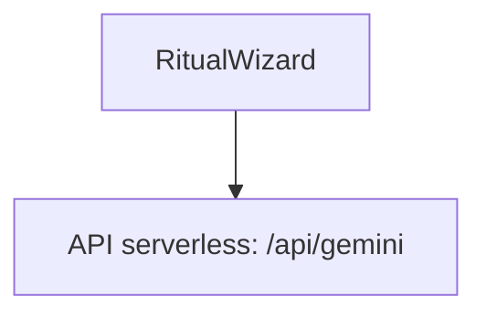

# Oracle Z Demo — Rapport final de branche documentaire stricte

## Décision

**READY FOR REVIEW — OPTION A STRICTE**

La branche `docs/oracle-z-demo-presentation-20260430` a été reconstruite depuis le SHA certifié `oracle.z.demo` puis limitée à des changements documentaires.

## Démo officielle

URL publique de démonstration : [`https://appllmedwtfix.vercel.app`](https://appllmedwtfix.vercel.app)

Cette URL est la cible Vercel de référence documentée par la branche vitrine.

## Contexte Git

| Champ | Valeur |
|---|---|
| Repo | `flobehejohn/Carte_de_visite` |
| Pull request | `#5` |
| Branche base | `oracle.z.demo` |
| Branche docs | `docs/oracle-z-demo-presentation-20260430` |
| SHA base certifié | `f5a0555a495e7b30037382bf510f750d614fc597` |
| Stratégie retenue | Option A — vitrine stricte |
| Démo officielle | `https://appllmedwtfix.vercel.app` |

## Périmètre conservé

Cette branche conserve uniquement :

```text
README.md
docs/**
artifacts/portfolio/**
```

## Périmètre explicitement exclu

Les modifications précédemment présentes dans les zones suivantes ont été supprimées par reconstruction de branche depuis `oracle.z.demo` :

```text
.github/**
scripts/**
src/**
```

## Fichiers documentaires ajoutés ou mis à jour

- `README.md`
- `docs/README.md`
- `docs/ARCHITECTURE_MASTER.md`
- `docs/RUNBOOK.md`
- `docs/certification/oracle-z-demo-certification.md`
- `docs/certification/evidence-index.md`
- `docs/certification/presentation-branch-final-report.md`
- `artifacts/portfolio/README.md`

`docs/SYSTEM_CONTRACT.md` est déjà présent dans la base runtime et reste la source normative.

## Correction Mermaid

Le README principal utilise maintenant des labels Mermaid cités, notamment :



Cette forme évite l’erreur GitHub liée à la syntaxe ambiguë `API[/api/gemini]`.

## Validation à relancer localement

Comme la branche est strictement documentaire, le minimum recommandé est :

```powershell
git fetch origin --prune
git switch docs/oracle-z-demo-presentation-20260430
git pull --ff-only origin docs/oracle-z-demo-presentation-20260430
git diff --check
npm.cmd run typecheck
npm.cmd run build
```

Pour réexécuter la certification complète :

```powershell
npm.cmd run test:optics
npm.cmd run test
npm.cmd run gate:bundle
pwsh -NoProfile -ExecutionPolicy Bypass -File .\scripts\gate-render.ps1
npm.cmd run test:e2e:first-paint
npm.cmd run test:e2e:visual-policy
pwsh -NoProfile -ExecutionPolicy Bypass -File .\scripts\audit-runtime.ps1
```

## Risques résiduels

| Risque | Niveau | Commentaire |
|---|---:|---|
| Validation locale post-reconstruction | Faible | À relancer par sécurité. |
| Mermaid GitHub | Faible | Syntaxe corrigée ; vérifier visuellement dans GitHub. |
| Portfolio encore vide | Faible | Structure prête ; les preuves lourdes restent à sélectionner. |
| URL déployée | Faible | URL officielle documentée : `https://appllmedwtfix.vercel.app`. |

## Verdict

La branche est maintenant propre pour une présentation professionnelle : elle est limitée à la documentation, aux preuves synthétiques et au portfolio, et pointe explicitement vers la démo Vercel officielle.
